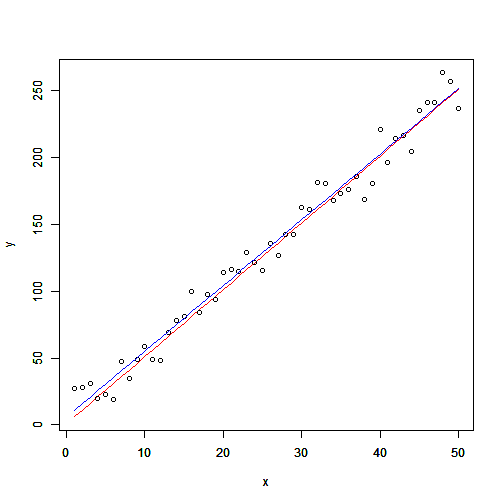
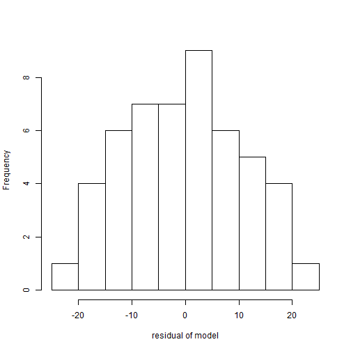

Study of Behaviour of a Linear Model
========================================================
author: Wolfgang Ecker-Lala
date: 2015-12-27

The Linear Model
========================================================

A Linear Model is described by following equation:
y=kx+d

where
- x is the input variable of the model (you can change the number of x which should be used)
- k is the slope
- d is the intercept
- y is the output

The linear model can be parameterized by changing the values **k** and **d** in the application.

After you have changed one of the values, press the *Calculate* button please.

Linear Model with some Disturbances
========================================================
In reality we will not have an exact linear model. We will have some disturbances and the equation changes to:y=kx+d+eps

**eps** is called the stochastic error.
<small>
In this application you can model the **eps** by using a normal distribution.
This distribution is described by **mue** and **sigma**.

The result of the modified values will be shown in four tabs.
- Plot of Model
- Plot of Residuals
- Fitted Model Summary
- Table (which only shows the calulated values - this needs no further explanation)

After you have changed one of the values, press the *Calculate* button please.
</small>

Plot of Model - Tab
========================================================
In the "Plot of Model" tab you can see how the real model (color RED) behaves against the model generated with disturbances (color BLUE).

 

Plot of Residuals - Tab
========================================================
In the "Plot of Residuals" tab you can see the distribution of the residuals.

 

